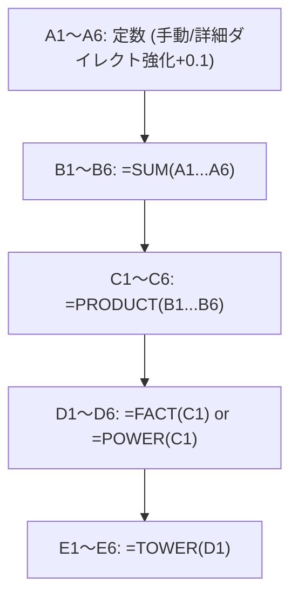

# ExcelDestroyer - セルシステム・行列大拡張・世界崩壊アーキテクチャ 完全統合仕様書（最終決定版）

本ドキュメントは、**「Excelという極めて事務的なソフトウェアを、宇宙的なインフレ装置へと改造し、最終的に数学と現実そのものを崩壊させるゲーム」**として構築するための、最終決定版のマスター仕様書です。

---

## 1. セルシステム（Cell System） ＆ 型定義

### 1.1. 厳格な CellType 定義（Enum）
すべてのセルは、ゲームシステム上で以下の役割を持った「計算ユニット」として定義される。

```gdscript
enum CellType {
    EMPTY,       # 未配置（未来の可能性）
    CONSTANT,    # 定数入力セル（インフレの源泉）
    SUM,         # 合算（線形成長の基盤）
    PRODUCT,     # 乗算（指数インフレの入口）
    FACT,        # 階乗（数学崩壊フェーズの始まり）
    POWER,       # 累乗（Prestige後の指数災害）
    TOWER,       # テトレーション（世界崩壊最終兵器）
    ERROR        # クラッシュエラー（#NUM!, #VALUE!, #REF!）
}
```

### 1.2. 各セルの詳細仕様と計算状態
* **EMPTY (完全空白セル)**:
  * 関数未配置時は、`0.0` などの邪魔な文字を一切表示せず、**本物Excelのように完全に何も表示しない「完全な空白」**として美しく描画される。
* **CONSTANT (定数セル)**:
  * A列専用。初期値 `1.0` から始まり、レベルアップ購入で **`+0.1` ずつ** 地道かつ精緻に強化可能。
* **SUM (合算セル)**:
  * B列。A列のすべての行（1〜6行）の定数値を動的にスキャンし、リアルタイムに合算する。
* **PRODUCT (乗算セル)**:
  * C列。B列のすべての行（1〜6行）の計算結果をすべてスキャンし、一気に掛け算する。
* **FACT (階乗セル)**:
  * D列。指定したマスの値を元に階乗（Factorial）を計算。
  * **巨大数安全インフレバイパス**: 引数が `exponent >= 1`（10以上）の超巨大数の場合、浮動小数点数の熱融解クラッシュを避けるため、安全ループ上限の `100` に `n` を自動固定して計算。連鎖インフレを破綻させずに最大火力を出力。
* **POWER (累乗セル / 要転生1回)**:
  * D列。指数関数的に数値を爆発させる。Prestige後に解き放たれる指数災害。
* **TOWER (テトレーションセル / 要転生2回)**:
  * E列。「パワーの塔（Tetration）」を積層させ、世界を真の崩壊へ導く最終兵器。
* **ERROR (崩壊セル)**:
  * オーバーフロー限界値（`overflow_limit`）を超えた瞬間に発生する、世界の断末魔（`#NUM!`）。

---

## 2. ２Ｄグリッドトポロジー（行列大拡張・5列6行設計）

本物のExcelの機能美とプレイ時の高揚感を最大化するため、グリッドを **横5列（A〜E列）**、**縦6行（1〜6行）** の超宇宙インフレ規模へと拡張している。



* **列（Columns / 横方向）**: 最大5列の「役割固定スロット」。
  * **A列（CONSTANT）**: 基礎定数値（+0.1ずつレベルアップ）。
  * **B列（SUM）**: A列のスキャン動的合計。
  * **C列（PRODUCT）**: B列のスキャン動的総乗。
  * **D列（FACT or POWER）**: 階乗またはべき乗。
  * **E列（TOWER）**: テトレーション（絶対禁忌の最終演算）。
* **行（Rows / 縦方向）**: コインを支払って **最大6行（1〜6行）** まで「行を挿入」し、積層していける動的拡張スロット。

---

## 3. 段階的アンロックチェーン ＆ ショップクリーンアップ

### 3.1. 3段式アンロックドミノ
成長目標を美しく提示するため、右のショップメニューとセルの右クリックメニューが100%シンクロしてベールを脱いでいく段階的開示。
1. **足し合わせ相手の解放（`max_rows >= 2`）**: 行を挿入して初めてショップに「SUM アンロック」が出現。
2. **SUMの解放**: `=SUM` がセルに挿入可能になり、同時にショップに「PRODUCT アンロック」が出現。
3. **PRODUCTの解放**: `=PRODUCT` が挿入可能になり、ショップに「FACT アンロック」が出現。
4. **FACTの解放**: `=FACT` が挿入可能になり、右クリックに `🔒 POWER` がお披露目。

### 3.2. クリーンアップショップUI（引き算の美学）
* SUM、PRODUCT、FACTアンロックなど、最大購入数が1回限り（`max == 1`）のアンロックカードは、**購入が完了した瞬間にショップリストから自動で完全に非表示（スッキリ消滅）にされる。**
* 行を追加した瞬間にのみ、対応する **「A4 値+0.1」、「A5 値+0.1」、「A6 値+0.1」** の強化カードがショップに動的に姿を現す自動連動。

---

## 4. セルダブルクリック「詳細インスペクター」

セルを左ダブルクリックした瞬間に、マウス位置（画面外はみ出し防止機能付き）に極上のSFガラスモルフィズム調パネルが出現。

* **秒間売上貢献度（％）の対数比率演算**:
  * 天文学的巨大数同士の対数比（mantissaとexponentの差分）から比率を精密に割り出し、そのセルが全体DPSの何％を稼ぎ出しているかをリアルタイムに解析。
* **セルダイレクト定数ハック強化（A列のみ）**:
  * A列セルをダブルクリックした場合、インスペクター内に直接 **「定数ハック強化（コスト表示）」** ボタンが出現し、ショップを往復せずにその場でダイレクトにハック強化（+0.1）が可能。
* **SFフレーバーテキスト**:
  * 各関数の持つハッキングの歴史や狂気を演出する個別の解説文を搭載。

---

## 5. 動的・個別コスト設計（バランス制御）

ゲームバランスとテンポを極限まで引き締めるため、アップグレード配列に個別のコスト上昇倍率をパラメータ駆動で定義。

* **個別コストスケール（`cost_scale`）**:
  * **定数強化（A1〜A6）**: コストベースに対して **`3.5倍`** ずつ上昇。
  * **計算速度x2 (`recalc_speed`)**: 最強の効果を持つため、コストベース `100.0` に対し、購入ごとに **`6.0倍`** ずつ急勾配で価格が跳ね上がる。
* **初期オンボーディング（行追加ベースコスト引き下げ）**:
  * 最初期の行追加コスト `row_cost_base` を `50.0` から **`40.0`** へ引き下げ、開始直後のテンポを最適化。
* **グリッド拡張コストテーブル**:
  * 行の挿入コスト: `row_cost_base * pow(6.5, float(max_rows - 1))`
  * 列の追加コスト:
    * B列解放: `10.0` コイン
    * C列解放: `200.0` コイン
    * D列解放: **`5,000.0`** コイン
    * E列解放: **`100,000.0`** コイン

---

## 6. 秒間売上（真の秒間DPS）計算仕様

お金が貯まるスピードと、画面右上の「DPS」が、タイマーのスピード変更（計算速度x2）を含めて完全に物理同期。

* **1 tick あたりの売上高（`tick_gain`）**:
  * **「すべての数式（FORMULA）セルの計算値の合計 ＋ すべての定数（A1〜A6の有効な行）セルの値」** の合算（動的スキャンによりA2以降の定数値も完璧に合算）。
* **真の秒間DPS（Coins Per Second）**:
  * 1 tick あたりの売上高に対し、タイマーの間隔（`wait_time`）から割り出される1秒あたりの作動周波数を掛け合わせたリアルタイム生産量。
  $$\text{真のDPS} = \text{tick\_gain} \times \left( \frac{1.0}{\text{タイマー間隔（秒）}} \right)$$

---

## 7. 数学崩壊フェーズ ＆ 世界崩壊演出

### 7.1. 崩壊フェーズの進行
転生回数に応じて、ゲーム自体のフェーズが進行し、画面全体のランダムなセルが不規則に歪んだりズレたりする「グリッチ演出」が激増。
1. **`[NORMAL]` （転生0〜1回）**: 静寂で極深緑の静かなExcel世界。安定した事務ソフトの姿。
2. **`[CORRUPTED]` （転生2〜4回）**: 軽度のグリッチ、少しずつ崩壊の足音が近づく汚染された黄黒の世界。
3. **`[CRITICAL]` （転生5〜9回）**: UI崩壊開始、緊迫の赤黒の世界。文字化けやセルズレが発生。
4. **`[APOCALYPSE]` （転生10回以上）**: 数学と現実そのものが破綻した極彩マゼンタの世界。激しい画面振動。

### 7.2. 世界崩壊（Prestige）フロー
シートの値が `overflow_limit` を超えると、Excelが処理限界を迎え、バグクラッシュ（`#NUM!`）が発生。

```
[限界突破] ──► [全セルが #NUM! エラーにクラッシュ] ──► [画面が真っ赤に強烈フラッシュ]
                                                                  │
                                                                  ▼
[Blank Workbook（1x1シート）で綺麗に再始動] ◄── [再起動音 ＆ ブラックアウト] ◄── [転生パネル出現]
```

* **クラッシュ**: 全セルが赤い `#NUM!` エラーとなり、画面が強烈に赤点滅。シート全体が激しく振動する。
* **再起動演出**: 転生ボタンを押すと、画面がブラックアウト。静寂の中に響き渡るPCの起動音とともに、まっさらな `1x1` の「Blank Workbook」シートへと美しく復帰する。
* **転生恩恵**: 転生回数が増加し、マルチプライヤーが恒久加算（+0.5倍ずつ）、エラー上限値が10倍に上昇。さらに `POWER` や `TOWER` が使用可能になる。

---

## 8. アーキテクチャ構成設計（UIとロジックの完全分離）

UI層にゲームロジックを書かず、各モジュールの役割を完全に分離。

```
                  ┌──────────────────────┐
                  │       Main.gd        │
                  └──────────┬───────────┘
                             │
            ┌────────────────┼────────────────┐
            ▼                ▼                ▼
┌──────────────────────┐ ┌──────────────────────┐ ┌──────────────────────┐
│  SpreadsheetView.gd  │ │ ContextMenuManager.g │ │    GameManager.gd    │
│ (セル描画/ホバー/選択)│ │ (LOCKED表示/UI制御)  │ │ (ゲーム状態/計算/購入)│
└──────────────────────┘ └──────────────────────┘ └──────────────────────┘
```

* **IDベース・ラムダ堅牢検索**:
  * 右クリックのアンロック判定などにおいて、アップグレードカード配列のインデックス（`upgrades[4]` 等）によるアクセスを完全廃止。
  * **「ID文字列から動的に購入フラグを安全検索するラムダ関数（`is_purchased`）」** を実装し、今後アップグレードカードがいくら増減しても絶対にバグが発生しない完璧な堅牢性を達成。
* **SpreadsheetView (Main.gd / Cell.gd)**:
  * セルのレンダリング、ヘッダー、ホバー、セルの動的挿入と、崩壊時の `shake`、`glitch` 描画のみを担当。
* **ContextMenuManager (ContextMenuManager.gd)**:
  * 右クリックメニューのポップアップ、関数リストのLOCKED制御、段階的表示条件の適用など、UI専用。
* **GameManager (GameManager.gd)**:
  * コイン計算、アップグレード判定（`can_insert_function`）、購入、Prestige進行、フェーズ制御など、ゲームロジックの全権。
