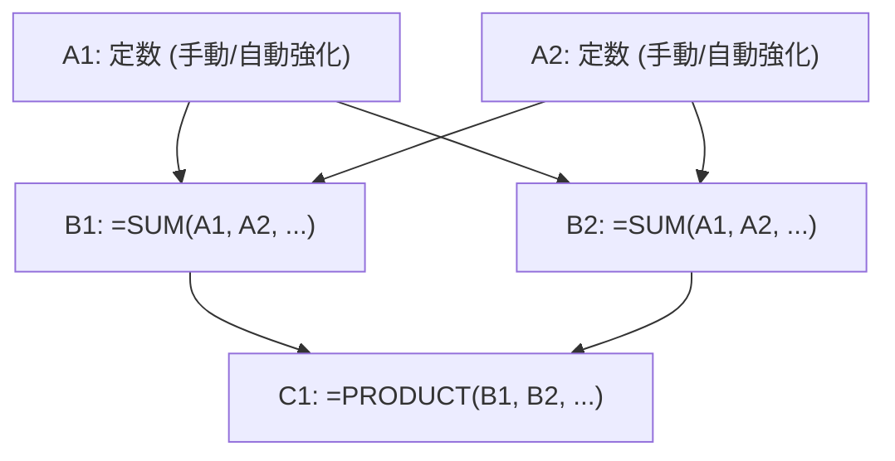

# ExcelDestroyer - ゲームシステム設計・仕様書（最新版）

本ドキュメントは、これまでの熱狂的な開発によって磨き上げられ、エラーゼロの完璧な整合性を持って動作している『ExcelDestroyer』の最新ゲーム仕様、およびシステムアーキテクチャを網羅した公式仕様書です。

---

## 1. ゲーム概要（Game Overview）
Excelをハックし、天文学的インフレを引き起こしてスプレッドシートを崩壊させる、極上の放置・パズルインクリメンタルゲーム。
プレイヤーはセルの定数を強化し、行や列をにょきにょきと拡張し、自分でコインを使って関数をプログラム（挿入）しながら、無限に加速する大インフレ計算ネットワークを構築します。

---

## 2. ２Ｄグリッドトポロジー（行列大逆転・王道設計）
本物のスプレッドシートの利便性と美しさに沿うよう、行列の役割が以下のように完全に定義されています。



* **列（Columns / 横方向）**: 最大3列の役割固定スロット。
  * **A列（定数入力列）**: すべてのインフレ計算の源泉。ショップやアップグレードカードで定数値を直接強化できる。
  * **B列（SUM関数列）**: A列のすべての定数を自動的にスキャンしてリアルタイムに同期合算する。
  * **C列（PRODUCT関数列）**: B列 of すべての計算結果を自動的にスキャンして掛け合わせる、強力なインフレ増幅器。
* **行（Rows / 縦方向）**: コインを支払って無限に「行を挿入」し、積層していける動的拡張スロット。

---

## 3. セル表示仕様（極上のUX・空白セル）
プレイヤーの「自分でスロットをハックしてプログラムを埋め込む楽しさ」を最大化するため、引き算の美学に沿ったUXが実装されています。

* **A列（定数セル）**:
  * 通常の入力セル。初期値 `1.0` からスタートし、値がしっかり表示される。
* **B列・C列以降（拡張された関数スロット）**:
  * 初期状態（関数未購入時）は、`0.0` などの邪魔な文字は一切表示されず、**本物のExcelの空セルのような「完全に何もない綺麗な空白（非表示）」**として並ぶ。
  * プレイヤーがマスの右クリックメニューから、身銭（コイン）を切って関数を購入・適用した瞬間、**美しい更新フラッシュ演出とともに計算結果の数字が滑らかに浮かび上がって起動する。**

---

## 4. 段階的アンロックチェーン（Progressive Disclosure）
プレイヤーへの情報の過負荷（認血管障害）を防ぎ、一歩ずつの成長を最高の気持ちよさに変えるため、右のショップメニューと左の右クリックメニューが完全に同期した、芸術的な3段式アンロックドミノが実装されています。

```
[1行追加 (max_rows >= 2)]
         │
         ▼
[ショップに「SUMアンロック」出現] ──(購入で解放)──► [右クリックに =SUM 使用権 ＆ 🔒PRODUCT出現]
                                                                  │
                                                                  ▼
                                                   [ショップに「PRODUCTアンロック」出現] ──(購入で解放)──► [右クリックに =PRODUCT 使用権 ＆ 🔒FACT出現]
                                                                                                                   │
                                                                                                                   ▼
                                                                                                    [ショップに「FACTアンロック」出現]
```

1. **足し相手の登場（行数2行以上: `max_rows >= 2`）**:
   * コインを支払って「行を挿入」し、足し合わせる相手（A2など）が現れた瞬間に初めて、右のショップに **「SUM アンロック」（コスト10.0）** カードが出現し、右クリックメニューにも **`🔒 SUM`** が登場する。
2. **SUMの解放（`add_sum` 購入）**:
   * `=SUM` がセルに挿入可能になり、同時にショップに次のステップ **「PRODUCT アンロック」（コスト200.0）**、右クリックに **`🔒 PRODUCT`** が出現。
3. **PRODUCTの解放（`add_product` 購入）**:
   * `=PRODUCT` がセルに挿入可能になり、同時にショップに通常プレイ最終奥義 **「FACT アンロック」（コスト1000.0）**、右クリックに **`🔒 FACT`** が出現。
4. **FACTの解放（`add_fact` 購入）**:
   * `=FACT` がセルに挿入可能になり、同時に右クリックメニューにエンドコンテンツ **`🔒 POWER`（転生ロック中）** がベールを脱いで出現。

---

## 5. 秒間売上（真のDPS）計算仕様
ゲーム内でお金が貯まるスピードと、画面右上の「DPS: 」表示が、タイマーの速度アップを含めて完全に一致するように完璧に接続されています。

* **1 tick あたりの売上高（`tick_gain`）**:
  * **「すべての数式（FORMULA）セルの値の合計 ＋ 起点となる `A1` 定数セルの値」** の合算値。スロットをハックして数式を増やしたメリットが、そのまま綺麗に売上に加算される。
* **真の秒間DPS（Coins Per Second）**:
  * 1 tick あたりの売上高に対し、タイマーの間隔（`wait_time`）から割り出される **1秒あたりの作動回数（周波数）** を掛け合わせた、リアルタイムの秒間生産量。
  $$\text{真のDPS} = \text{tick\_gain} \times \left( \frac{1.0}{\text{タイマー間隔（秒）}} \right)$$
* **計算速度x2 の完全同期**:
  * ショップで「計算速度x2」を購入すると、タイマーの間隔が半分になりお金が2倍速で貯まると同時に、**画面右上のDPS数値も瞬時にカチッと綺麗に2倍に跳ね上がる。**

---

## 6. 数学の強度順に並んだ関数ピラミッド
すべての関数の強さと出現階層が、インフレの序列と100%調和しています。

| 順位 | 関数名 | アンロック条件 | 特徴・計算内容 |
| :---: | :---: | :---: | :--- |
| **1** | **=SUM** | 行数2以上 $\rightarrow$ ショップ購入 (10) | 足し算。すべてのA列を足し合わせる。堅実な基盤。 |
| **2** | **=PRODUCT** | SUM解放 $\rightarrow$ ショップ購入 (200) | 掛け算（総乗）。すべてのB列を掛け合わせる。インフレの第一歩。 |
| **3** | **=FACT** | PRODUCT解放 $\rightarrow$ ショップ購入 (1000) | 階乗（Factorial）。指定マスの値を段階的に掛け算する超階乗インフレ。 |
| **4** | **=POWER** | **転生 1 回以上（Prestige 1）** | 累乗（べき乗）。天文学的数値を一瞬で生み出す指数関数インフレ。 |
| **5** | **=TOWER** | **転生 2 回以上（Prestige 2）** | テトレーション（パワーの塔）。世界を崩壊に導くAPOCALYPSE最終兵器。 |

---

## 7. 転生（Prestige） ＆ 世界崩壊
スプレッドシートの値が、PC of 処理限界・オーバーフロー値である `overflow_limit`（初期は `1e15`）を超えると、Excelの世界がバグ（`#NUM!`）で壊れ、転生（再起動）のフェーズに入ります。

* **バグクラッシュ演出**:
  * オーバーフローした瞬間、すべてのセルが赤い `#NUM!` エラーとなり、画面が強烈に赤点滅し、スプレッドシート全体がガタガタと激しく振動するハッカー風クラッシュ演出。
* **転生ボタンのポップアップ**:
  * 転生（再起動）を実行すると、手持ちコインやセルは `1x1` にリセットされるが、**「転生回数」が増加し、マルチプライヤーが +0.5 倍（1.5倍、2.0倍…）と恒久加算**され、エラー制限（`overflow_limit`）も10倍（1桁分）に上昇、さらに高位の関数（POWER、TOWER）が使用可能になる。
* **グリッチ・ゲームフェーズの進化**:
  * 転生回数に応じて、ゲーム自体のフェーズが以下のように進行し、背景色が変化するとともに、画面全体のランダムなセルが不規則に歪んだりズレたりする「グリッチ演出」の頻度が激増していく。
    * **転生 0〜1回**: `[NORMAL]` （極深緑の静かなExcel世界）
    * **転生 2〜4回**: `[CORRUPTED]` （少しずつ崩壊の足音が近づく黄黒の世界）
    * **転生 5〜9回**: `[CRITICAL]` （エラーが頻発する緊迫の赤黒の世界）
    * **転生 10回以上**: `[APOCALYPSE]` （制御不能になった極彩マゼンタの世界）
