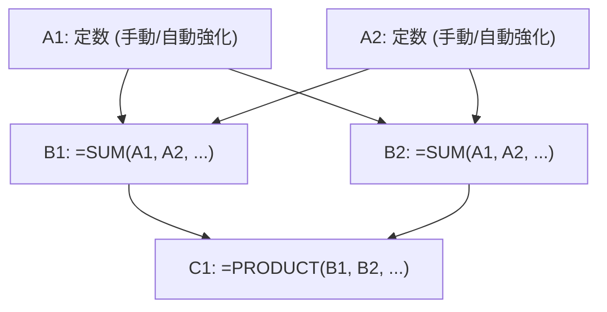

# ExcelDestroyer - セルシステム・関数進化・世界崩壊アーキテクチャ 完全統合仕様書

本ドキュメントは、**「Excelという極めて事務的なソフトウェアを、宇宙的なインフレ装置へと改造し、最終的に数学と現実そのものを崩壊させるゲーム」**として構築するための最高設計仕様書です。
単なるUIや数値を増やすだけのゲームではなく、「人類がExcelを酷使し、その限界を超えて数学と現実をバグらせる」という狂気に満ちた哲学を、強固なGodot 4アーキテクチャとして定義します。

---

## 1. コア設計思想（Core Philosophy）

### 「これは、Upgradeボタンを押すゲームではない」
プレイヤーは「Upgrade」を強化しているのではなく、スプレッドシートのグリッド（計算スロット）をハックし、関数をプログラミングして「計算ネットワーク」を育てる。
すべての生産、インフレ、崩壊、エラー、そして転生（Prestige）は、すべて**「セル（Cell）」**を中心に展開する。

---

## 2. セルシステム（Cell System） ＆ 型定義

### 2.1. 厳格な CellType 定義（Enum）
すべてのセルは、ゲームシステム上で以下の役割を持った「計算ユニット」として定義される。

```gdscript
enum CellType {
    EMPTY,       # 未配置（未来の可能性）
    CONSTANT,    # 定数入力セル（インフレの源泉）
    SUM,         # 合算（線形成長の基盤）
    PRODUCT,     # 乗算（指数インフレの入口）
    FACT,        # 階乗（数学崩壊フェーズの始まり）
    POWER,       # 累乗（Prestige後の指数災害）
    TOWER,       # テトレーション（世界崩壊最終兵器）
    ERROR        # クラッシュエラー（#NUM!, #VALUE!, #REF!）
}
```

### 2.2. 各セルの詳細仕様と計算状態
* **EMPTY (完全空白セル)**:
  * 単なる `0` や `null` ではない。「未来に何をプログラムするか」という**「可能性」**そのもの。
  * 関数未配置時は、`0.0` などの邪魔な文字を一切表示せず、**本物Excelのように完全に何も表示しない「完全な空白」**として描画される。
* **CONSTANT (定数セル)**:
  * A列専用。初期値 `1.0` から始まり、すべてのインフレの始祖となる。
* **SUM (合算セル)**:
  * A列（すべての行）の定数値を動的にスキャンし、リアルタイムに合算する。
* **PRODUCT (乗算セル)**:
  * B列（すべての行）の計算結果をすべてスキャンし、一気に掛け算する。
* **FACT (階乗セル)**:
  * 指定したマスの値を元に階乗（Factorial）を計算。数学崩壊を引き起こす。
* **POWER (累乗セル / 要転生1回)**:
  * 指数関数的に数値を爆発させる。Prestige後に解き放たれる指数災害。
* **TOWER (テトレーションセル / 要転生2回)**:
  * 「パワーの塔（Tetration）」を積層させ、世界を真の崩壊へ導く最終兵器。
* **ERROR (崩壊セル)**:
  * オーバーフロー限界値（`overflow_limit`）を超えた瞬間に発生する、世界の断末魔。

### 2.3. 動的参照スキャナー（`source_refs`）
関数セルは、描画時にその時々のシート全体の配列を自動スキャンし、依存関係である `source_refs`（例：B列は「A1〜A{max}」）をリアルタイムに上書き同期して自己計算する。
この動的バインドによって、行の挿入時にも数式が自動拡張スキャンされ、一瞬で計算網が同期する。
また、後半の「依存関係ループ（`#REF!`）」や「値エラー（`#VALUE!`）」などの崩壊演出も、この `source_refs` を辿ることでリアルタイム描画が可能となる。

---

## 3. ２Ｄグリッドトポロジー（行列王道設計）

本物のExcelの機能美とプレイ時の高揚感を両立するため、行列に以下の完璧な役割と動的トポロジーを構築している。



* **列（Columns / 横方向）**: 最大3列の「役割固定スロット」。
  * **A列（CONSTANT）**: 基礎定数値。
  * **B列（SUM）**: A列のスキャン合計。
  * **C列（PRODUCT）**: B列のスキャン総乗。
* **行（Rows / 縦方向）**: コインを支払って無限に「行を挿入」し、積層していける拡張スロット。

---

## 4. 段階的アンロックチェーン ＆ ショップ同期
プレイヤーの認知負荷を排除し、成長目標を美しく提示するため、右のショップメニューとセルの右クリックメニューが100%完璧にシンクロしてベールを脱いでいく、3段式アンロックドミノを実装。

```
[1行追加 (max_rows >= 2)]
         │
         ▼
[ショップに「SUMアンロック」出現] ──(購入で解放)──► [右クリックに =SUM 使用権 ＆ 🔒PRODUCT出現]
                                                                  │
                                                                  ▼
                                                   [ショップに「PRODUCTアンロック」出現] ──(購入で解放)──► [右クリックに =PRODUCT 使用権 ＆ 🔒FACT出現]
                                                                                                                   │
                                                                                                                   ▼
                                                                                                    [ショップに「FACTアンロック」出現]
```

1. **足し合わせ相手の解放（`max_rows >= 2`）**:
   * 行を追加し、足し合わせる相手（A2など）が現れて初めて、右ショップに「SUM アンロック（コスト10.0）」が出現。右クリックメニューにも `🔒 SUM` が登場。
2. **SUMの解放**:
   * `=SUM` がセルに挿入可能になり、同時にショップに「PRODUCT アンロック（コスト200.0）」、右クリックに `🔒 PRODUCT` が出現。
3. **PRODUCTの解放**:
   * `=PRODUCT` がセルに挿入可能になり、同時にショップに通常最終「FACT アンロック（コスト1,000.0）」、右クリックに `🔒 FACT` が出現。
4. **FACTの解放**:
   * `=FACT` がセルに挿入可能になり、同時に右クリックにエンドコンテンツ `🔒 POWER（Requires Prestige 1）` がお披露目。

---

## 5. 秒間売上（真の秒間DPS）計算仕様
お金が貯まるスピードと、画面右上の「DPS」が、タイマーのスピード変更を含めて完全に物理同期。

* **1 tick あたりの売上高（`tick_gain`）**:
  * **「すべての数式（FORMULA）セルの値の合計 ＋ 起点となる `A1` 定数セルの値」** の合算。数式を増やしたメリットがそのまま綺麗に売上に加算される。
* **真の秒間DPS（Coins Per Second）**:
  * 1 tick あたりの売上高に対し、タイマーの間隔（`wait_time`）から割り出される **1秒あたりの作動回数（周波数）** を掛け合わせた、リアルタイムの秒間生産量。
  $$\text{真のDPS} = \text{tick\_gain} \times \left( \frac{1.0}{\text{タイマー間隔（秒）}} \right)$$
* **計算速度x2 の完全同期**:
  * 「計算速度x2」を購入するとタイマー間隔が半分になり、画面右上のDPS数値も**瞬時にカチッと完璧に2倍に跳ね上がる。**

---

## 6. 数学崩壊フェーズ ＆ 世界崩壊演出

### 6.1. 崩壊フェーズの進行
転生回数に応じて、ゲーム自体のフェーズが以下のように進行し、画面全体のランダムなセルが不規則に歪んだりズレたりする「グリッチ演出」が激増する。

1. **[NORMAL] （転生 0〜1回）**:
   * 静寂で極深緑の静かなExcel世界。安定した事務ソフトの姿。
2. **[CORRUPTED] （転生 2〜4回）**:
   * 軽度のグリッチ、少しずつ崩壊の足音が近づく汚染された黄黒の世界。
   * **PRODUCT解放ログ**: `[WARN] Exponential instability detected.`
3. **[CRITICAL] （転生 5〜9回）**:
   * UI崩壊開始、緊迫の赤黒の世界。文字化けやセルズレが発生。
   * **FACT解放ログ**: `[WARN] Floating point precision compromised. Overflow risk: HIGH`
4. **[APOCALYPSE] （転生 10回以上）**:
   * 制御不能、数学と現実そのものが破綻した極彩マゼンタの世界。激しい画面振動。
   * **POWER/TOWER解放ログ**: `[CRIT] Reality overflow imminent. Mathematical framework collapsed.`

### 6.2. 世界崩壊（Prestige）フロー
シートの値が `overflow_limit`（初期は `1e15`）を超えると、Excelの世界が処理限界を迎え、バグクラッシュ（`#NUM!`）が発生。

```
[限界突破] ──► [全セルが #NUM! エラーにクラッシュ] ──► [画面が真っ赤に強烈フラッシュ]
                                                                  │
                                                                  ▼
[Blank Workbook（1x1シート）で綺麗に再始動] ◄── [再起動音 ＆ ブラックアウト] ◄── [転生パネル出現]
```

* **クラッシュ**: 全セルが赤い `#NUM!` エラーとなり、画面が強烈に赤点滅。シート全体がガタガタと激しく振動。
* **再起動演出**: 転生ボタンを押すと、画面がブラックアウトし、静寂の中に響き渡るPCの起動音とともに、まっさらな `1x1` の「Blank Workbook」シートへと美しく復帰する。
* **転生恩恵**: 転生回数が増加し、マルチプライヤーが恒久加算（+0.5倍ずつ）、エラー上限値（`overflow_limit`）が10倍に上昇。さらに `POWER` や `TOWER` が使用可能になる。

---

## 7. アーキテクチャ構成設計（UIとロジックの完全分離）

UI層にゲームロジックを書かず、各モジュールの役割を完全に分離。

```
                  ┌──────────────────────┐
                  │       Main.gd        │
                  └──────────┬───────────┘
                             │
            ┌────────────────┼────────────────┐
            ▼                ▼                ▼
┌──────────────────────┐ ┌──────────────────────┐ ┌──────────────────────┐
│  SpreadsheetView.gd  │ │ ContextMenuManager.g │ │    GameManager.gd    │
│ (セル描画/ホバー/選択)│ │ (LOCKED表示/UI制御)  │ │ (ゲーム状態/計算/購入)│
└──────────────────────┘ └──────────────────────┘ └──────────────────────┘
```

* **SpreadsheetView (Main.gd / Cell.gd)**:
  * セルのレンダリング、ヘッダー、ホバー、セルの動的挿入と、崩壊時の `shake`（振動）、`glitch` 描画のみを担当。
* **ContextMenuManager (ContextMenuManager.gd)**:
  * 右クリックメニューのポップアップ、関数リストのLOCKED制御、段階的表示条件の適用など、UI専用。
* **GameManager (GameManager.gd)**:
  * コイン計算、アップグレード判定（`can_insert_function`）、購入、Prestige進行、フェーズ制御など、ゲームロジックの全権。
